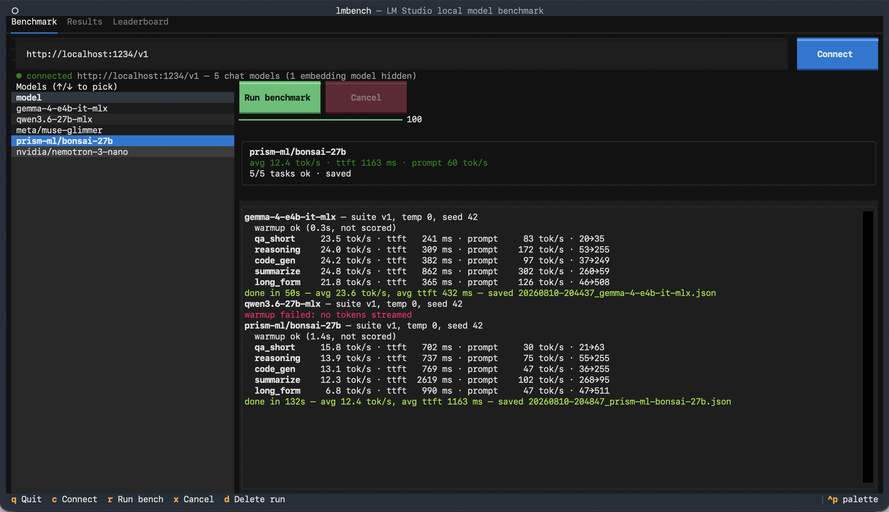

# lmbench

A tiny single-file TUI for benchmarking local LLMs served by
[LM Studio](https://lmstudio.ai) — or any OpenAI-compatible endpoint
(Ollama, llama.cpp server, vLLM, …).

Pick a model, press `r`, get comparable numbers. Every run is saved and feeds
a local leaderboard.



## Quickstart

Requires Python ≥ 3.10 and a running LM Studio server
(Developer tab → **Start server**, default `http://localhost:1234/v1`).

With [uv](https://docs.astral.sh/uv/) (dependencies resolve automatically from
the script header):

```bash
uv run lmbench.py
```

Without uv:

```bash
./run.sh
```

(creates a local venv with `textual` + `httpx` on first use), or manually:

```bash
python3 -m venv .venv
.venv/bin/pip install "textual>=1.0" "httpx>=0.27"
.venv/bin/python lmbench.py
```

Point it elsewhere with the endpoint field or `LMSTUDIO_ENDPOINT`.

## What it measures

A fixed, deterministic suite (v1): warmup + 5 prompts — short QA, math
reasoning, code generation, summarization of a fixed passage, and long-form
writing — all at temperature 0, seed 42, fixed `max_tokens`. Identical prompts
every run, so results are comparable across models and over time. The warmup
absorbs model load time and is never scored.

Per task and per run:

| metric | meaning |
|---|---|
| **gen tok/s** | decode speed: `(completion_tokens − 1) / time after first token` |
| **ttft** | time to first streamed token |
| **prompt tok/s** | prompt processing speed: `prompt_tokens / ttft` |
| **quality** | 0–100 output-quality score against reference answers (below) |

Token counts come from the server's `usage` field, falling back to counting
stream chunks (marked *estimated*) on servers that don't report usage.

## Quality score

Each scored task also gets a deterministic, formulaic quality score — no LLM
judge, so scores are reproducible and comparable across machines:

- **60% objective checks**, per task: the math task must reach the correct
  answer; the generated `is_prime` is actually executed against 10 fixed unit
  tests (in a `python -I` subprocess with a 10 s timeout); the essay is
  checked for coverage of 8 key concepts; the summary for sentence count and
  topicality; the QA answer for the physically correct keywords.
- **40% n-gram similarity** (ROUGE-style unigram + bigram F1) to bundled
  reference answers written by Claude (Fable 5).

`<think>…</think>` blocks from reasoning models are stripped before scoring.
Treat the number as a sanity signal, not an eval harness: a correct answer
phrased very differently from the reference scores mid-range on the
similarity component, and 5 fixed prompts is a small sample. It will reliably
flag a broken or badly quantized model; it won't rank two good ones
precisely.

Runs saved before this feature show "—" in the quality columns.

## Tabs

1. **Benchmark** — endpoint + connect, model list (embedding models hidden),
   live stats, progress, log
2. **Results** — every saved run, with a per-task breakdown for the
   highlighted row
3. **Leaderboard** — models ranked by average gen tok/s across all saved
   runs, with quality alongside

Runs are stored as JSON in `~/.lmbench/results/` (override with `LMBENCH_DIR`),
one self-describing file per run — including the full model outputs, so you
can inspect answers or re-score later.

## Keys

`c` connect · `r` run benchmark · `x` cancel · `d` delete highlighted run
(Results tab) · `q` quit

## Notes

- If JIT model loading is disabled in LM Studio, load the model there first;
  otherwise the first request loads it (absorbed by warmup).
- A model that streams no tokens (failed load, crashed runtime) shows up as a
  failed task rather than crashing the run.
- Benchmarks are single-request and sequential by design — this measures
  interactive single-user speed, not batched throughput.
